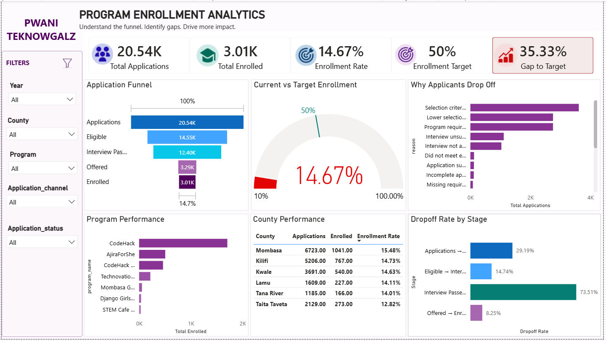

# Stakeholder Recommendation

## Table of Contents

- [Cover Page](#cover-page)
- [Executive Summary](#executive-summary)
- [Project Objectives](#project-objectives)
- [Key Findings](#key-findings)
- [Business Insights](#business-insights)
- [Dashboard Highlights](#dashboard-highlights)
- [Recommendations](#recommendations)
- [Implementation Roadmap](#implementation-roadmap)
- [Future Enhancements](#future-enhancements)
- [Conclusion](#conclusion)

## Cover Page

| | |
|---|---|
| **Project Title** | Program Enrollment Analytics |
| **Client / Organization** | Pwani Teknowgalz |
| **Prepared By** | Sunday Layefa & Sammy Shoka |

## Executive Summary

This analysis examined the applicant enrollment funnel to identify major points of applicant loss, factors associated with enrollment, and areas where operational improvements could increase enrollment toward the 50% target.

The key finding is that the **largest bottleneck occurs between Interview Passed and Offer**, where **73.51% of applicants are lost**, representing 9,117 applicants. In contrast, **91.75% of applicants who receive offers enroll**, showing that offer-to-enrollment conversion is already strong.

Selection criteria, ranking, and program requirements are the main contributors to applicant loss. Performance also varies across counties and programs, with Mombasa recording the highest county enrollment rate and STEM Cafe Kenya and Technovation Challenge recording the strongest program enrollment rates.

Overall, the analysis indicates that increasing the number of qualified applicants who progress to the offer stage through capacity expansion and improvements to the selection process is likely to have the greatest impact on overall enrollment.

## Project Objectives

The project aims to:

1. **Evaluate the enrollment funnel** to identify where applicants are most likely to drop off.
2. **Identify the key reasons for applicant loss** at different stages of the enrollment process.
3. **Determine factors associated with successful enrollment**, including applicant progression through eligibility, interviews, and offers.
4. **Compare enrollment performance across counties and programs** to identify high-performing areas and potential benchmarks.
5. **Identify the funnel stage with the greatest improvement opportunity** and quantify its potential impact on enrollment.
6. **Translate the findings into practical operational recommendations** that can help increase enrollment toward the organization's 50% target.

## Key Findings

**1. The major bottleneck is the Offer stage**

73.51% of applicants are lost between Interview Passed and Offer, representing 9,117 applicants. This is the largest drop-off point in the funnel.

**2. Offer-to-enrollment conversion is strong**

91.75% of applicants who receive an offer enroll, indicating that the primary issue is getting qualified applicants to the offer stage rather than converting offers into enrollments.

**3. Selection is a major source of applicant loss**

Selection criteria, ranking, and program requirements account for significant applicant losses, suggesting an opportunity to review the selection and allocation process.

**4. Performance varies across counties**

Mombasa has the highest enrollment rate at 15.48%, followed by Kilifi and Kwale, providing potential benchmarks for improving performance in other counties.

**5. Program performance varies**

CodeHack has the highest enrollment volume (1,705 enrollments), while STEM Cafe Kenya (21.48%) and Technovation Challenge (20.69%) have the strongest enrollment rates.

## Business Insights

**1. The Offer stage is the critical enrollment bottleneck**

The largest loss in the funnel occurs between **Interview Passed and Offer**, with a **73.51% drop-off representing 9,117 applicants**. This indicates that a substantial number of applicants who successfully pass the interview do not progress to an offer.

**2. The organization is effective at converting offers into enrollments**

The **Offer → Enrollment stage has only an 8.25% drop-off**, meaning **91.75% of applicants who receive offers enroll**. This suggests that improving post-offer conversion is unlikely to deliver as much impact as increasing the number of qualified applicants who receive offers.

**3. Selection processes are contributing significantly to applicant loss**

Selection criteria, ranking, and program requirements are among the leading exit reasons. This suggests that the organization should review whether its selection process and available capacity are appropriately aligned with the pool of qualified applicants.

**4. Performance differs across locations and programs**

Mombasa has the highest county enrollment rate at **15.48%**, while STEM Cafe Kenya and Technovation Challenge record the strongest program enrollment rates. These areas can provide useful benchmarks for understanding practices associated with stronger enrollment outcomes.

**5. There is an opportunity to improve decision-making through better resource data**

The current data cannot reliably establish whether resource availability influences enrollment. Capturing resource availability alongside applicant and enrollment outcomes would allow this relationship to be evaluated in future analyses.

## Dashboard Highlights

## Recommendations

**1. Review the Interview-to-Offer Process**

Investigate why applicants who successfully pass interviews are not progressing to offers. Review selection criteria, ranking procedures, program requirements, and available cohort capacity.

**2. Expand Capacity Where Demand Exceeds Available Places**

Evaluate whether the number of available program centres is sufficient relative to the number of qualified applicants. Where feasible, increase cohort capacity or create additional program centre opportunities.

**3. Review and Standardize Selection Criteria**

Assess whether selection criteria and ranking processes are consistently applied and aligned with program objectives. Identify areas where qualified applicants may be unnecessarily excluded.

**4. Learn from High-Performing Programs and Counties**

Examine the practices, outreach methods, selection processes, and operational approaches used by high-performing counties and programs. Adapt successful practices where appropriate rather than applying a one-size-fits-all approach.

**5. Improve Tracking of Applicant Exit Reasons**

Ensure that every applicant who leaves the funnel has a clearly recorded and standardized exit reason. This will enable the organization to monitor changes in drop-off patterns and evaluate whether interventions are working.

**6. Strengthen Resource-Level Data Collection**

Capture resource availability and capacity alongside applicant outcomes. This would allow future analysis to determine whether resource constraints are associated with enrollment outcomes.

## Implementation Roadmap

| Phase | Timeline | Key Actions | Expected Output |
|---|---|---|---|
| 1. Diagnose | 0–1 Months | Review Interview → Offer losses, selection criteria, ranking and program requirements | Clear understanding of the main bottleneck |
| 2. Redesign | 1–2 Months | Review selection process and assess cohort capacity against qualified applicant volume | Improved selection and offer-allocation process |
| 3. Pilot | 2–3 Months | Test revised selection/offer processes in selected programs or counties | Evidence of whether interventions improve progression |
| 4. Scale | 3–6 Months | Expand successful interventions across programs and counties | Increased qualified-to-offer conversion |
| 5. Monitor | Ongoing | Track funnel conversion, exit reasons, county/program performance and enrollment against the 50% target | Continuous performance improvement |

## Future Enhancements

- Real-time dashboards
- Mobile reporting
- Database schema

## Conclusion

The analysis identifies a clear opportunity to improve the organization's enrollment performance: **the greatest loss occurs before applicants receive an offer, not after**. With 73.51% of applicants lost between Interview Passed and Offer, compared with only 8.25% lost after receiving an offer, the selection and offer-allocation process should be the primary focus of intervention.

Expanding capacity where feasible, reviewing selection criteria and ranking processes, and learning from high-performing programs and counties can help increase the number of qualified applicants progressing to offers. Combined with stronger data collection and ongoing funnel monitoring, these actions can provide a practical pathway toward improving enrollment and progressing toward the organization's **50% target**.